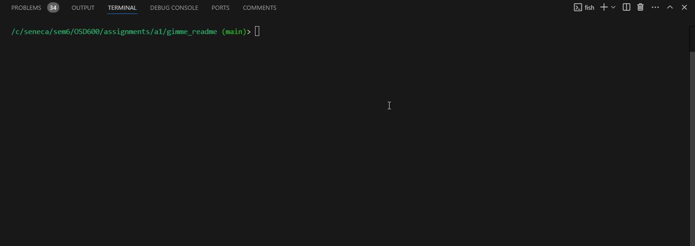

# gimme_readme

`gimme_readme` is a command-line tool powered by AI that generates a comprehensive `README.md` file for your project. It analyzes multiple source code files at once, providing concise explanations of each file's purpose, functionality, and key components, all in a single, easy-to-read document. This makes your project more approachable and understandable for others.



See our [0.1 Release Demo](https://youtu.be/S6v-u9o_Xx8)!

## Table of Contents

1. [Getting Started](#1-getting-started)
2. [Usage](#2-usage)
3. [Example Usage](#3-example-usage)
4. [Supported Models by Providers](#4-supported-models-by-providers)
5. [Contributing](#5-contributing)
6. [Author](#6-author)

## 1. Getting Started

To get started with `gimme_readme`, follow these steps:

1. Install the latest version of [Node.js](https://nodejs.org/en/download/package-manager) for your operating system.
2. Run the following command to install `gimme_readme` globally:

   ```sh
   npm i -g gimme_readme
   ```

3. Generate a configuration file by running:

   ```sh
   gr-ai -c
   ```

   This command creates a `.gimme_readme_config` file in your home directory. **Do not move this file from this location.**

4. Open the `.gimme_readme_config` file and add your API keys and preferred default values as prompted. Ensure you leave the variable names unchanged.

   - Subsequent runs of `gr-ai -c` will display the path to your existing config file.
   - See [here](./env.sample) for an example of what a `.gimme_readme_config` file looks like!

## 2. Usage

`gimme_readme` uses AI to generate a `README.md` file that explains a given source code file or files. Below are the available options:

| Option                         | Description                                                               |
| ------------------------------ | ------------------------------------------------------------------------- |
| `-v`, `--version`              | Output the current version                                                |
| `-f`, `--file [files...]`      | Specify one or more files to generate explanations for                    |
| `-o`, `--outputFile <string>`  | Specify the file to output the generated README to                        |
| `-m`, `--model <string>`       | Choose a free-tier AI model to use (e.g., gemini, openai, grok)           |
| `-p`, `--prompt <string>`      | Provide a custom prompt to the AI                                         |
| `-c`, `--config`               | Show the location of the configuration file and provide links to examples |
| `-t`, `--temperature <number>` | Set the level of determinism for the AI (value between 0 and 1)           |
| `-h`, `--help`                 | Display help for the command                                              |

## 3. Example Usage

Below are some simple examples to help you get started with `gimme_readme`. For more detailed examples,
see [here](./_examples/README.md).

### Display Help

To display the help menu with all available commands:

```sh
gr-ai -h
```

### Display Version Number

To show the current version of `gimme_readme`:

```sh
gr-ai -v
```

### Generate a README for a Source File

To generate a `README.md` file for one or more source files:

```sh
gr-ai -f example.js anotherFile.py -o README.md -m gemini-1.5-flash
```

## 4. Supported Models by Providers

| Provider | Models           |
| -------- | ---------------- |
| `gemini` | gemini-1.5-flash |
| `groq`   | llama3-8b-8192   |

## 5. Contributing

We welcome contributions to improve `gimme_readme`! To contribute, please follow these steps:

1. Check the [existing issues](https://github.com/peterdanwan/gimme_readme/issues) to see if your issue or feature request has already been logged.
2. If your issue or feature request is already listed, add your comments or create a pull request with your proposed changes.
3. If your issue or suggestion is not listed, feel free to create a new issue. If possible, provide a pull request that addresses the issue.

When making a pull request, please ensure that your changes are well-documented and adhere to the coding standards of the project.

## 6. Author

Developed by [Peter Wan](https://github.com/peterdanwan).

For any questions or feedback, feel free to reach out through the GitHub repository.
