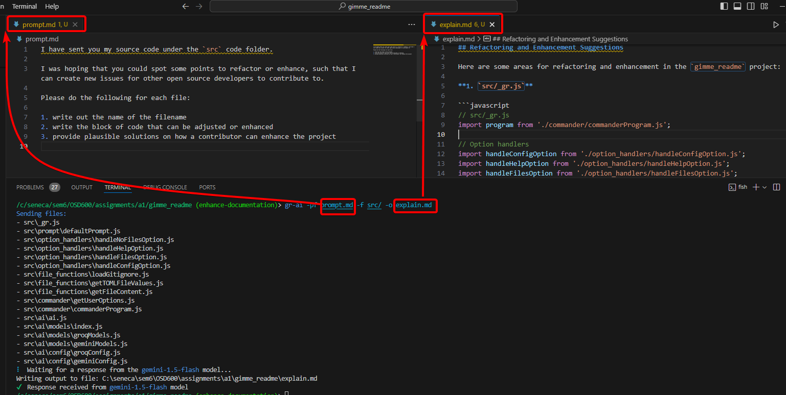
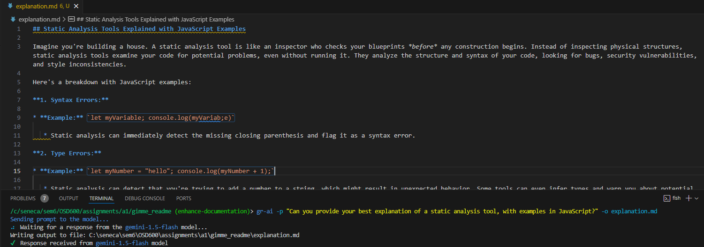

# Example Commands

## Display Help

```sh
# Can run this...
gr-ai

# This...
gr-ai -h

# Or this
gr-ai --help
```


> `NOTE`: there is always going to be a `shorthand version` of a flag/option. The subsequent examples will prefer the shorthand flags when writing commands.

## Show version

```sh
gr -v
```


## Make a .gimme_readme_config file / find its location

```sh
# Makes a .gimme_readme_config file if it's not there already
# Or, helps you find the path to your existing .gimme_readme_config file
gr -c
```

Creates a config file if it doesn't exist already:


Locates the config file if it does exist:


## Explain a file, output the result to a specific file, and set the temperature for the model

```sh
gr-ai -m gemini-1.5-flash -f tests/unit/_gr.test.js -o explanation.md -t 0.1
```


## Use the text from a custom prompt file, and send files within a particular folder

```sh
gr-ai -pf prompt.md -f src/ -o explain.md
```



## Make a prompt directly from the command-line

```sh
gr-ai -p "Can you provide your best explanation of a static analysis tool, with examples in JavaScript?" -o explanation.md
```


